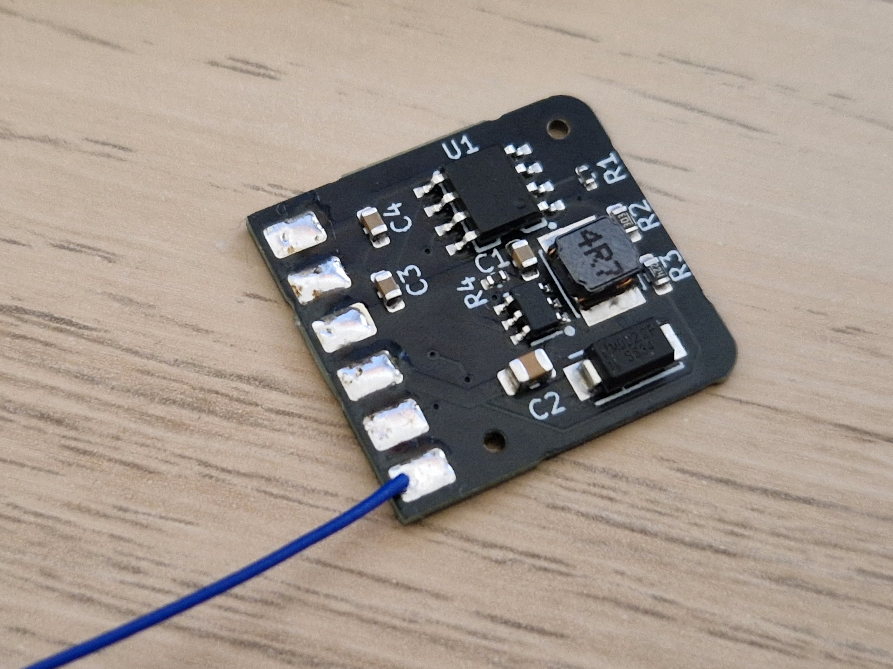

# NWPi - NumWorks Pi Power Module

Power module PCB for running a Raspberry Pi Zero inside a NumWorks calculator.

## Specs
- **Input:** USB 5V 1A
- **Battery:** 3.7V LiPo (TP4056 charger, 600mA)
- **Output:** 5V 1.5A (SX1308 boost)
- **Size:** 19 × 20.5mm

## Components
- TP4056 - LiPo charger IC
- SX1308 - Boost converter
- SS34 - Schottky diode
- 4.7µH inductor

## Files
- `nwpi.kicad_sch` - Schematic
- `nwpi.kicad_pcb` - PCB layout
- `production/` - Gerbers for JLCPCB

## License
MIT
